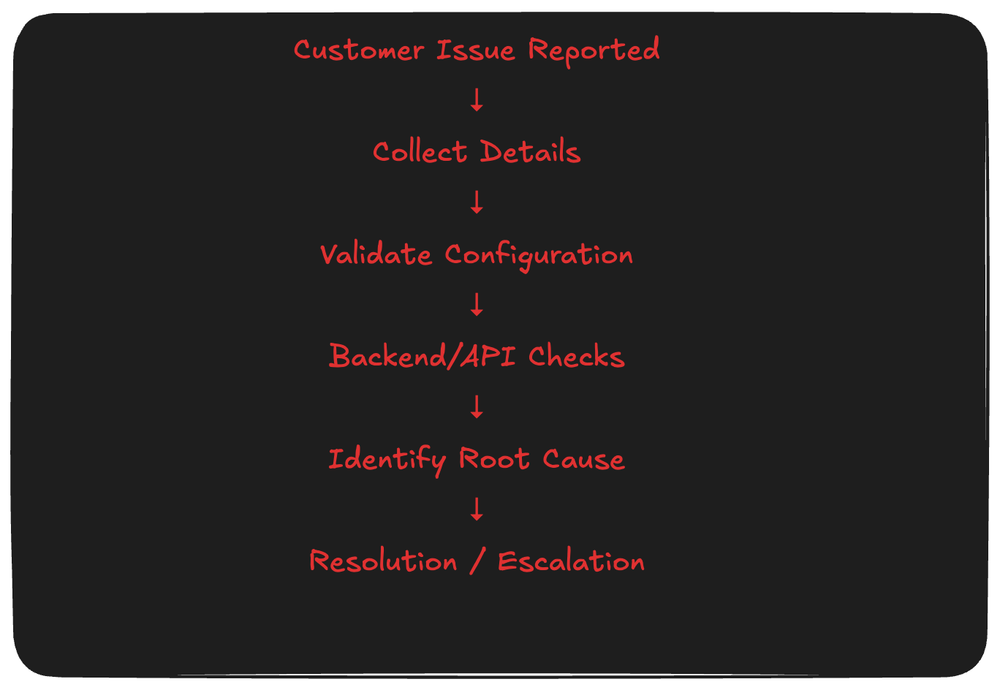

# Integration Troubleshooting Checklist

A structured troubleshooting framework used during SaaS implementations and system integrations to quickly identify configuration issues, API failures, and data mismatches.

## Who this is for
- Implementation Analysts
- Integration Engineers
- UAT/Test teams
- Support & Technical Operations

## Troubleshooting Workflow

When integrations fail, teams often troubleshoot inconsistently.  
This checklist provides a repeatable process to:

- Gather accurate issue context
- Validate configuration quickly
- Identify backend/API problems
- Reduce escalation time

---

## What This Demonstrates

✔ Structured troubleshooting methodology  
✔ Implementation & onboarding workflows  
✔ Root cause analysis thinking  
✔ Documentation clarity  
✔ Real-world SaaS operational practices

---

## Checklist Contents

See: **integration_checklist.md**

Covers:

1. Customer Issue Collection
2. Configuration Validation
3. Backend & API Checks
4. Logging and Response Analysis

---

## Ideal Use Cases

- SaaS onboarding teams
- Implementation analysts
- Support engineers
- UAT validation workflows
- Integration troubleshooting

---

## Author

Leovie Martos  
Implementation & Systems Analyst transitioning into AI + SaaS Technical Solutions
